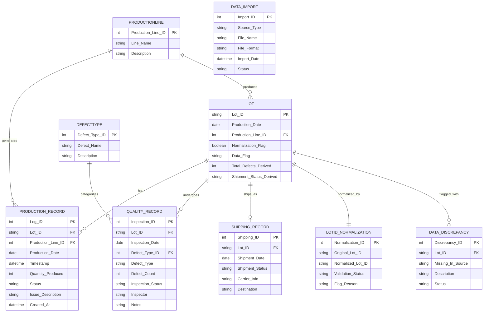

# Google Gemini

# Operations Data Consolidation: Data Model

This document outlines the data entities, attributes, and relationships extracted from the Operations Analyst user story. The goal is to create a unified dataset linking production, quality, and shipping logs via a normalized Lot ID.

---

## 1. Data Entities & Attributes

### **Lot (Core Entity)**
*The central hub used to join disparate data sources.*
* **Lot_ID**: Primary Identifier (Normalized/Cleaned).
* **Production_Date**: The date the batch was created.
* **Normalization_Flag**: Boolean indicator for IDs that required manual review or formatting fixes.

### **Production_Record**
*Source: Production Logs.*
* **Log_ID**: Unique identifier for the log entry.
* **Lot_ID**: Foreign Key (Links to Lot).
* **Production_Line**: Name/ID of the line where the lot was processed.
* **Timestamp**: Exact time of production.
* **Issue_Description**: Qualitative notes on production hiccups.

### **Quality_Record**
*Source: Quality Inspection Files.*
* **Inspection_ID**: Unique identifier for the inspection event.
* **Lot_ID**: Foreign Key (Links to Lot).
* **Defect_Type**: Categorical (e.g., Scratch, Functional, Dimensional).
* **Defect_Count**: Numerical count of defects found.
* **Inspection_Status**: Pass/Fail indicator.

### **Shipping_Record**
*Source: Shipping Spreadsheets.*
* **Shipping_ID**: Unique identifier for the shipment log.
* **Lot_ID**: Foreign Key (Links to Lot).
* **Shipment_Status**: Enum (Shipped, Pending, Not Shipped).
* **Carrier_Info**: (Optional) Details on the shipping provider.

---

## 2. Entity Relationships

The following table describes how these entities interact within the system.

| Relationship | Cardinality | Description |
| :--- | :--- | :--- |
| **Production Line** → **Lot** | 1:N | One production line generates many unique lots. |
| **Lot** → **Quality Record** | 1:N | A single lot may undergo multiple quality checks or have multiple defect entries. |
| **Lot** → **Shipping Record** | 1:1 | Each lot typically maps to one final shipping status entry. |
| **Consolidated View** | N:N | The system joins all three sources based on the **Lot_ID** to create a master record. |

---

## 3. Data Validation & Logic Rules

> [!IMPORTANT]
> To meet AC3 (Lot ID Normalization) and AC8 (Consistency Checks), the system must apply the following logic:

1. **Sanitization**: All `Lot_ID` strings must be trimmed of whitespace and converted to UPPERCASE before processing.
2. **Orphan Detection**: If a `Lot_ID` appears in the **Shipping_Record** but not the **Production_Record**, it must be flagged for "Source Discrepancy."
3. **Trend Logic**: Defect trends (AC5) are calculated by aggregating `Defect_Count` grouped by `Defect_Type` over the `Production_Date` timeline.

---

# ChatGPT

# Operations Data Consolidation – Data Entities & Relationships

## 1. Core Entities

### ProductionLine
- **ProductionLineID (PK)**
- LineName
- Description

---

### ProductionLog
- **ProductionID (PK)**
- LotID
- ProductionDate
- ProductionLineID (FK → ProductionLine)
- QuantityProduced
- Status
- CreatedAt

---

### QualityInspection
- **InspectionID (PK)**
- LotID (FK → ConsolidatedLot)
- InspectionDate
- DefectTypeID (FK → DefectType)
- DefectCount
- Inspector
- Notes

---

### DefectType
- **DefectTypeID (PK)**
- DefectName
- Description

---

### ShippingRecord
- **ShipmentID (PK)**
- LotID (FK → ConsolidatedLot)
- ShipmentDate
- ShipmentStatus (Shipped / Pending / Not Shipped)
- Destination
- Carrier

---

### ConsolidatedLot (Unified View)
- **LotID (PK – Normalized)**
- ProductionDate
- ProductionLineID (FK → ProductionLine)
- TotalDefects (Derived)
- ShipmentStatus (Derived)
- DataFlags (Missing / Inconsistent / Unmatched)

---

### DataImport
- **ImportID (PK)**
- SourceType (Production / Quality / Shipping)
- FileName
- FileFormat (CSV / Excel)
- ImportDate
- Status (Success / Failed / Partial)

---

## 2. Data Quality & Validation Entities

### LotIDNormalization
- **NormalizationID (PK)**
- OriginalLotID
- NormalizedLotID
- ValidationStatus (Valid / Ambiguous / Unmatched)
- FlagReason

---

### DataDiscrepancy
- **DiscrepancyID (PK)**
- LotID
- MissingInSource (Production / Quality / Shipping)
- Description
- Status (Open / Reviewed / Resolved)

---

## 3. Relationships

### Core Relationships
- ProductionLine (1) → (Many) ProductionLog
- ProductionLog (Many) → (1) ConsolidatedLot (via LotID)
- ConsolidatedLot (1) → (Many) QualityInspection
- DefectType (1) → (Many) QualityInspection
- ConsolidatedLot (1) → (0..1) ShippingRecord

---

### Data Matching Rules
Records are matched using:
- LotID (primary key for consolidation)
- ProductionDate (secondary match criteria)

---

## 4. Derived / Reporting Entities (Logical Views)

### ProductionLineIssueSummary
- ProductionLineID
- DateRange
- IssueCount
- TotalDefects

---

### DefectTrend
- DefectTypeID
- Date (Day/Week)
- DefectCount

---

### ShipmentStatusSummary
- LotID
- ShipmentStatus
- FlagStatus

---

## 5. High-Level Entity Relationship Structure

ProductionLine  
└── ProductionLog  
  └── ConsolidatedLot  
    ├── QualityInspection  
    │  └── DefectType  
    └── ShippingRecord  

ConsolidatedLot  
└── DataDiscrepancy  
└── LotIDNormalization  

---

# Combined

# Operations Data Consolidation – Unified Data Model

This document defines the consolidated data entities, attributes, relationships, validation rules, and reporting structures required to support production, quality, and shipping data integration.  
The goal is to create a single, reliable dataset that eliminates manual spreadsheet work and enables fast summary reporting.

---

# 1. Core Data Model

## 1.1 Lot (Core / Master Entity)

*Central hub used to join all operational data sources.*

- **Lot_ID (PK)** – Primary Identifier (Normalized/Cleaned)
- Production_Date – Date batch was produced
- Production_Line_ID (FK → ProductionLine)
- Normalization_Flag – Boolean (true if formatting required correction)
- Data_Flag – Missing / Inconsistent / Unmatched indicator
- Total_Defects (Derived)
- Shipment_Status (Derived)

---

## 1.2 ProductionLine

- **Production_Line_ID (PK)**
- Line_Name
- Description

---

## 1.3 Production_Record (Source: Production Logs)

- **Log_ID (PK)**
- Lot_ID (FK → Lot)
- Production_Line_ID (FK → ProductionLine)
- Production_Date
- Timestamp
- Quantity_Produced
- Status
- Issue_Description (Production hiccups/notes)
- Created_At

---

## 1.4 Quality_Record (Source: Quality Inspection Files)

- **Inspection_ID (PK)**
- Lot_ID (FK → Lot)
- Inspection_Date
- Defect_Type_ID (FK → DefectType)
- Defect_Type (Categorical – Scratch, Functional, Dimensional, etc.)
- Defect_Count
- Inspection_Status (Pass/Fail)
- Inspector
- Notes

---

## 1.5 DefectType (Reference Table)

- **Defect_Type_ID (PK)**
- Defect_Name
- Description

---

## 1.6 Shipping_Record (Source: Shipping Spreadsheets)

- **Shipping_ID (PK)**
- Lot_ID (FK → Lot)
- Shipment_Date
- Shipment_Status (Shipped / Pending / Not Shipped)
- Carrier_Info
- Destination

---

## 1.7 DataImport (Multi-Source File Tracking)

Supports AC1 – Multi-Source Import

- **Import_ID (PK)**
- Source_Type (Production / Quality / Shipping)
- File_Name
- File_Format (CSV / Excel)
- Import_Date
- Status (Success / Failed / Partial)

---

# 2. Data Quality & Validation Entities

## 2.1 LotID_Normalization

Supports AC3 – Lot ID Standardization

- **Normalization_ID (PK)**
- Original_Lot_ID
- Normalized_Lot_ID
- Validation_Status (Valid / Ambiguous / Unmatched)
- Flag_Reason

---

## 2.2 Data_Discrepancy

Supports AC8 – Data Consistency Checks

- **Discrepancy_ID (PK)**
- Lot_ID (FK → Lot)
- Missing_In_Source (Production / Quality / Shipping)
- Description
- Status (Open / Reviewed / Resolved)

---

# 3. Entity Relationships

| Relationship | Cardinality | Description |
|--------------|------------|-------------|
| ProductionLine → Production_Record | 1:N | One production line creates many production records |
| ProductionLine → Lot | 1:N | One production line generates many lots |
| Lot → Production_Record | 1:N | A lot may have multiple production log entries |
| Lot → Quality_Record | 1:N | A lot may undergo multiple inspections |
| DefectType → Quality_Record | 1:N | One defect type appears in many inspection records |
| Lot → Shipping_Record | 1:0..1 | A lot may have one final shipment record |
| Lot → Data_Discrepancy | 1:N | A lot may have multiple discrepancy flags |
| Lot → LotID_Normalization | 1:1 | Each lot has one normalized representation |
| Consolidated View | N:N Logical Join | System joins Production, Quality, and Shipping via Lot_ID (Primary) and Production_Date (Secondary) |

---

# 4. Reporting & Derived Views

Supports AC4, AC5, AC6, AC9

## 4.1 ProductionLineIssueSummary (Derived View)

- Production_Line_ID
- Date_Range
- Issue_Count
- Total_Defects

Used for:
- Weekly production issue summaries
- Filtering by date range

---

## 4.2 DefectTrend (Derived View)

- Defect_Type_ID
- Defect_Type
- Date (Day/Week)
- Defect_Count (Aggregated)

Used for:
- Trend visualization over time
- Defect grouping by type

---

## 4.3 ShipmentStatusSummary (Derived View)

- Lot_ID
- Shipment_Status
- Flag_Status (Missing / Inconsistent)
- Shipment_Date

Supports lot search functionality (AC6).

---

# 5. Data Matching & Validation Logic

Supports AC3 (Normalization) and AC8 (Consistency Checks)

## 5.1 Lot ID Sanitization Rules

1. Trim leading and trailing whitespace.
2. Convert all characters to UPPERCASE.
3. Remove non-standard formatting characters (if applicable).
4. Store original value in `LotID_Normalization`.

---

## 5.2 Matching Rules

Records are consolidated using:

- Primary Match Key: `Lot_ID`
- Secondary Match Key: `Production_Date` (for ambiguity resolution)

---

## 5.3 Discrepancy Detection Rules

- If Lot exists in Quality but not Production → Flag as Missing Production Record.
- If Lot exists in Shipping but not Production → Flag as Source Discrepancy.
- If Lot exists in Production but not Shipping → Flag as Pending Shipment.
- If multiple conflicting shipment statuses exist → Flag as Inconsistent Shipment Data.

---

## 5.4 Defect Trend Logic

Defect trends are calculated by:

---

# ERD Diagram

